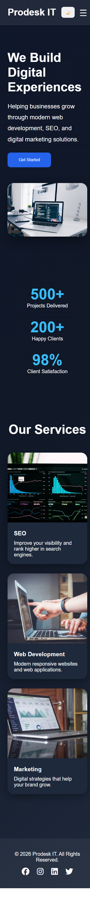

# Prodesk IT Landing Page

## Overview

This project is a responsive landing page developed for Sprint 01 at Prodesk IT.

The objective was to build a modern and responsive marketing landing page using HTML, CSS, and JavaScript while demonstrating strong fundamentals in layout design, responsiveness, styling, and user interaction.

## Features

- Responsive Navigation Bar
- Mobile Hamburger Menu
- Hero Section with Call-to-Action
- Services Section using CSS Grid
- Sticky Navigation Bar
- Dark / Light Theme Toggle
- Hover Animations and Micro-Interactions
- Glassmorphism Navigation Effect
- Responsive Design for Mobile and Desktop Devices
- Smooth Scrolling Navigation

## Technologies Used

- HTML5
- CSS3
- JavaScript (Vanilla JS)
- Font Awesome

## Project Structure

prodesk-it-landing-page/

├── index.html

├── style.css

├── script.js

├── README.md

├── Prompts.md

└── assets/

    └── screenshot.png

## assests

## Screenshot

## Live Demo

https://prodesk-it-landing-page.netlify.app/

## GitHub Repository

github.com/shreyap2052-sys/prodesk-it-landing-page

## Learning Outcomes

Through this sprint, I practiced:

- Responsive Web Design
- Flexbox and CSS Grid Layouts
- JavaScript DOM Manipulation
- Mobile-First Design Principles
- UI/UX Enhancements
- Deployment and Version Control Workflows

## Author

Shreya Pandey

Sprint 01 Submission – Prodesk IT
